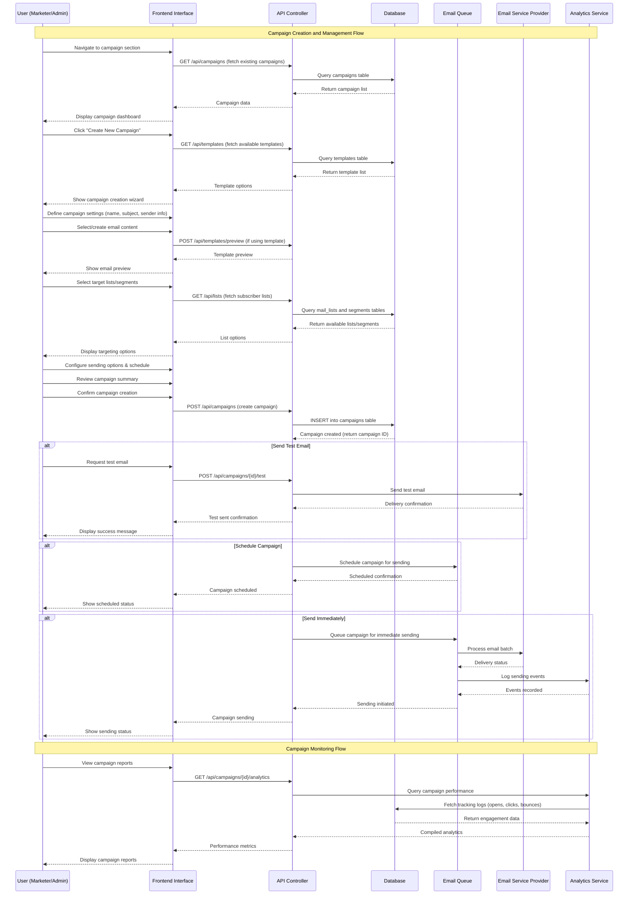
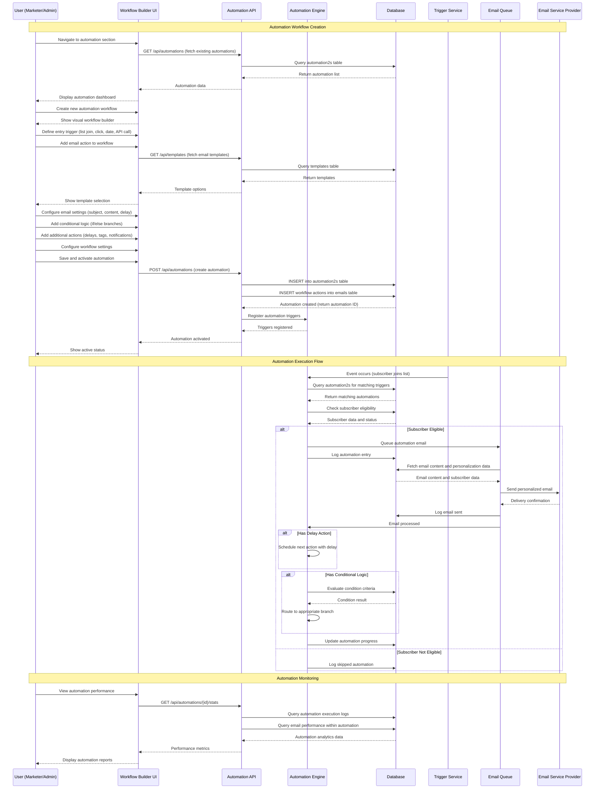

# PERFEXMAIL Sequence Diagrams

## UC001: Manage Email Campaigns

## UC004: Automate Email Workflows

## UC005: Manage Users & Team Accounts

```mermaid
sequenceDiagram
    participant User as New User
    participant UI as Frontend Interface
    participant Auth as Auth Service
    participant API as API Controller
    participant DB as Database
    participant Email as Email Service
    participant Admin as Administrator

    Note over User,Admin: User Registration Flow

    User->>UI: Access registration page
    UI-->>User: Display registration form

    User->>UI: Submit registration details (name, email, password)
    UI->>Auth: POST /api/auth/register
    Auth->>DB: Check if email already exists
    DB-->>Auth: Email availability status
    
    alt Email Available
        Auth->>DB: INSERT into users table
        Auth->>DB: INSERT into teams table (if team registration)
        DB-->>Auth: User account created
        Auth->>Email: Send verification email
        Email-->>Auth: Email sent confirmation
        Auth-->>UI: Registration successful
        UI-->>User: Show verification message
    else Email Already Exists
        Auth-->>UI: Email already registered error
        UI-->>User: Display error message
    end

    Note over User,Admin: Email Verification Flow

    User->>Email: Click verification link in email
    Email->>UI: Redirect to verification page
    UI->>Auth: GET /api/auth/verify/{token}
    Auth->>DB: Validate verification token
    DB-->>Auth: Token validation result
    
    alt Valid Token
        Auth->>DB: UPDATE user status to verified
        DB-->>Auth: User verified
        Auth-->>UI: Verification successful
        UI-->>User: Account activated message
    else Invalid Token
        Auth-->>UI: Invalid verification token
        UI-->>User: Verification failed message
    end

    Note over User,Admin: User Login Flow

    User->>UI: Access login page
    UI-->>User: Display login form

    User->>UI: Submit credentials (email, password)
    UI->>Auth: POST /api/auth/login
    Auth->>DB: Query user credentials
    DB-->>Auth: User data and hashed password
    Auth->>Auth: Validate password hash
    
    alt Valid Credentials
        Auth->>DB: Create user session
        Auth->>DB: Query user permissions and team data
        DB-->>Auth: User profile and permissions
        Auth-->>UI: Login successful with session token
        UI->>UI: Store session token
        UI-->>User: Redirect to dashboard
    else Invalid Credentials
        Auth-->>UI: Invalid credentials error
        UI-->>User: Display error message
    end

    Note over User,Admin: Admin User Management Flow

    Admin->>UI: Access user management dashboard
    UI->>API: GET /api/admin/users (fetch all users)
    API->>DB: Query users and teams tables
    DB-->>API: User list with team associations
    API-->>UI: User management data
    UI-->>Admin: Display user list

    Admin->>UI: Create new user account
    UI->>API: POST /api/admin/users/create
    API->>DB: INSERT into users table
    API->>DB: INSERT into teams table (if applicable)
    DB-->>API: User created
    API->>Email: Send welcome email with credentials
    Email-->>API: Email sent
    API-->>UI: User creation successful
    UI-->>Admin: Display success message

    Admin->>UI: Edit user permissions/role
    UI->>API: PUT /api/admin/users/{id}/permissions
    API->>DB: UPDATE user permissions
    DB-->>API: Permissions updated
    API-->>UI: Update successful
    UI-->>Admin: Display confirmation

    Note over User,Admin: Password Reset Flow

    User->>UI: Request password reset
    UI->>Auth: POST /api/auth/forgot-password
    Auth->>DB: Verify email exists
    DB-->>Auth: Email verification result
    
    alt Email Exists
        Auth->>DB: Generate password reset token
        Auth->>Email: Send password reset email
        Email-->>Auth: Email sent
        Auth-->>UI: Reset email sent
        UI-->>User: Check email message
    else Email Not Found
        Auth-->>UI: Email not found error
        UI-->>User: Display error message
    end

    User->>Email: Click reset link in email
    Email->>UI: Redirect to password reset page
    UI-->>User: Display new password form

    User->>UI: Submit new password
    UI->>Auth: POST /api/auth/reset-password
    Auth->>DB: Validate reset token
    DB-->>Auth: Token validation result
    
    alt Valid Token
        Auth->>DB: UPDATE user password
        DB-->>Auth: Password updated
        Auth-->>UI: Password reset successful
        UI-->>User: Password updated message
    else Invalid Token
        Auth-->>UI: Invalid or expired token
        UI-->>User: Reset failed message
    end
```

## UC008: View Reports & Analytics

```mermaid
sequenceDiagram
    participant U as User (Marketer/Admin)
    participant UI as Analytics UI
    participant API as Analytics API
    participant Cache as Redis Cache
    participant DB as Database
    participant Aggregator as Data Aggregator
    participant Export as Export Service

    Note over U,Export: Analytics Dashboard Loading

    U->>UI: Navigate to reports section
    UI->>API: GET /api/reports/dashboard
    API->>Cache: Check cached dashboard data
    Cache-->>API: Cache status
    
    alt Cache Hit
        Cache-->>API: Return cached data
        API-->>UI: Dashboard data
        UI-->>U: Display analytics dashboard
    else Cache Miss
        API->>DB: Query campaign performance metrics
        API->>DB: Query subscriber engagement data
        API->>DB: Query automation statistics
        DB-->>API: Raw analytics data
        API->>Aggregator: Process and aggregate data
        Aggregator-->>API: Processed metrics
        API->>Cache: Store processed data
        API-->>UI: Dashboard data
        UI-->>U: Display analytics dashboard
    end

    Note over U,Export: Campaign Report Generation

    U->>UI: Select specific campaign report
    UI->>API: GET /api/reports/campaigns/{id}
    API->>Cache: Check campaign report cache
    
    alt Cache Miss
        API->>DB: Query tracking_logs for campaign
        API->>DB: Query open_logs for opens
        API->>DB: Query click_logs for clicks
        API->>DB: Query bounce_logs for bounces
        API->>DB: Query unsubscribe_logs for unsubscribes
        DB-->>API: Campaign tracking data
        
        API->>Aggregator: Calculate performance metrics
        Aggregator->>Aggregator: Process open rates
        Aggregator->>Aggregator: Calculate click-through rates
        Aggregator->>Aggregator: Analyze bounce rates
        Aggregator->>Aggregator: Generate geo-location data
        Aggregator->>Aggregator: Analyze device/client data
        Aggregator-->>API: Comprehensive campaign metrics
        
        API->>Cache: Cache report data
        Cache-->>API: Data cached
    end
    
    API-->>UI: Campaign report data
    UI-->>U: Display detailed campaign analytics

    Note over U,Export: List Growth Analysis

    U->>UI: Request list growth report
    UI->>API: GET /api/reports/lists/{id}/growth
    API->>DB: Query subscriber history data
    API->>DB: Query subscription events over time
    API->>DB: Query unsubscribe events
    DB-->>API: List growth data
    
    API->>Aggregator: Calculate growth trends
    Aggregator->>Aggregator: Process subscription rates
    Aggregator->>Aggregator: Calculate retention metrics
    Aggregator->>Aggregator: Analyze churn patterns
    Aggregator-->>API: Growth analytics
    
    API-->>UI: List growth metrics
    UI-->>U: Display growth visualization

    Note over U,Export: Automation Performance Report

    U->>UI: View automation analytics
    UI->>API: GET /api/reports/automations/{id}
    API->>DB: Query automation execution logs
    API->>DB: Query email performance within workflows
    API->>DB: Query conversion tracking data
    DB-->>API: Automation performance data
    
    API->>Aggregator: Calculate workflow metrics
    Aggregator->>Aggregator: Process completion rates
    Aggregator->>Aggregator: Analyze drop-off points
    Aggregator->>Aggregator: Calculate conversion rates
    Aggregator-->>API: Automation analytics
    
    API-->>UI: Automation performance data
    UI-->>U: Display workflow analytics

    Note over U,Export: Report Export and Filtering

    U->>UI: Apply date range filter
    UI->>API: GET /api/reports/campaigns?start_date=X&end_date=Y
    API->>DB: Query data with date constraints
    DB-->>API: Filtered data
    API-->>UI: Updated report data
    UI-->>U: Display filtered results

    U->>UI: Request data export
    UI->>API: POST /api/reports/export
    API->>Export: Generate export file (CSV/PDF)
    Export->>DB: Fetch detailed data for export
    DB-->>Export: Complete dataset
    Export->>Export: Format data for export
    Export-->>API: Export file ready
    API-->>UI: Download link
    UI-->>U: Provide download link

    Note over U,Export: Real-time Analytics Updates

    loop Every 30 seconds
        UI->>API: GET /api/reports/realtime
        API->>DB: Query recent activity
        DB-->>API: Latest metrics
        API-->>UI: Real-time updates
        UI->>UI: Update dashboard widgets
    end
```

## UC010: Manage Sending Infrastructure

```mermaid
sequenceDiagram
    participant Admin as Administrator
    participant UI as Admin Interface
    participant API as Infrastructure API
    participant DB as Database
    participant DNS as DNS Service
    participant ESP as Email Service Provider
    participant Validator as Domain Validator
    participant Monitor as Delivery Monitor

    Note over Admin,Monitor: Sending Server Configuration

    Admin->>UI: Navigate to sending servers
    UI->>API: GET /api/admin/sending-servers
    API->>DB: Query sending_servers table
    DB-->>API: Server configurations
    API-->>UI: Server list
    UI-->>Admin: Display server management

    Admin->>UI: Add new sending server
    UI-->>Admin: Display server configuration form

    Admin->>UI: Configure server details (SMTP/API settings)
    UI->>API: POST /api/admin/sending-servers/test
    API->>ESP: Test connection with provided credentials
    ESP-->>API: Connection test result
    
    alt Connection Successful
        API-->>UI: Test successful
        UI-->>Admin: Show success message
        
        Admin->>UI: Save server configuration
        UI->>API: POST /api/admin/sending-servers
        API->>DB: INSERT server configuration
        DB-->>API: Server saved
        API-->>UI: Configuration saved
        UI-->>Admin: Server configured successfully
    else Connection Failed
        API-->>UI: Test failed with error details
        UI-->>Admin: Display connection error
    end

    Note over Admin,Monitor: Domain Authentication Setup

    Admin->>UI: Navigate to sending domains
    UI->>API: GET /api/admin/sending-domains
    API->>DB: Query sending_domains table
    DB-->>API: Domain configurations
    API-->>UI: Domain list
    UI-->>Admin: Display domain management

    Admin->>UI: Add new sending domain
    UI-->>Admin: Display domain setup form

    Admin->>UI: Enter domain name
    UI->>API: POST /api/admin/sending-domains/generate-records
    API->>API: Generate SPF, DKIM, DMARC records
    API->>DB: Store domain configuration
    DB-->>API: Domain record saved
    API-->>UI: DNS records to configure
    UI-->>Admin: Display required DNS records

    Admin->>DNS: Configure DNS records (external)
    
    Admin->>UI: Verify domain configuration
    UI->>API: POST /api/admin/sending-domains/{id}/verify
    API->>Validator: Check DNS record propagation
    Validator->>DNS: Query DNS records
    DNS-->>Validator: DNS record values
    Validator->>Validator: Validate SPF record
    Validator->>Validator: Validate DKIM record
    Validator->>Validator: Validate DMARC record
    Validator-->>API: Validation results
    
    alt All Records Valid
        API->>DB: UPDATE domain status to verified
        DB-->>API: Domain verified
        API-->>UI: Domain verification successful
        UI-->>Admin: Show verified status
    else Validation Failed
        API-->>UI: Validation errors with details
        UI-->>Admin: Display DNS configuration issues
    end

    Note over Admin,Monitor: Bounce Handler Configuration

    Admin->>UI: Configure bounce handling
    UI-->>Admin: Display bounce handler form

    Admin->>UI: Enter bounce mailbox details (IMAP/POP3)
    UI->>API: POST /api/admin/bounce-handlers/test
    API->>API: Test mailbox connection
    
    alt Connection Successful
        API-->>UI: Mailbox connection successful
        UI-->>Admin: Show connection success
        
        Admin->>UI: Save bounce handler configuration
        UI->>API: POST /api/admin/bounce-handlers
        API->>DB: Store bounce handler config
        DB-->>API: Configuration saved
        API-->>UI: Bounce handler configured
        UI-->>Admin: Configuration successful
    else Connection Failed
        API-->>UI: Mailbox connection failed
        UI-->>Admin: Display connection error
    end

    Note over Admin,Monitor: Delivery Monitoring

    loop Every 15 minutes
        Monitor->>DB: Fetch recent bounce emails
        Monitor->>API: Process bounce messages
        API->>DB: UPDATE subscriber statuses
        API->>DB: Log bounce events
        
        Monitor->>DB: Fetch complaint reports
        Monitor->>API: Process complaint messages
        API->>DB: UPDATE subscriber statuses
        API->>DB: Log complaint events
        
        Monitor->>API: Calculate delivery metrics
        API->>DB: Store delivery statistics
    end

    Admin->>UI: View delivery statistics
    UI->>API: GET /api/admin/delivery-stats
    API->>DB: Query delivery metrics
    DB-->>API: Delivery statistics
    API-->>UI: Delivery data
    UI-->>Admin: Display delivery dashboard

    Note over Admin,Monitor: Infrastructure Health Monitoring

    loop Every 5 minutes
        Monitor->>ESP: Check sending server status
        ESP-->>Monitor: Server health status
        Monitor->>DB: Log server health metrics
        
        alt Server Issues Detected
            Monitor->>API: Send alert notification
            API->>Admin: Email/SMS alert
        end
    end
```

These sequence diagrams represent the core workflows for PERFEXMAIL's most critical use cases, showing the interaction between users, interface components, APIs, databases, and external services. Each diagram illustrates the complete flow from user action to system response, including error handling and alternative paths. 