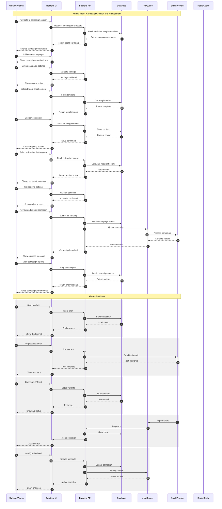
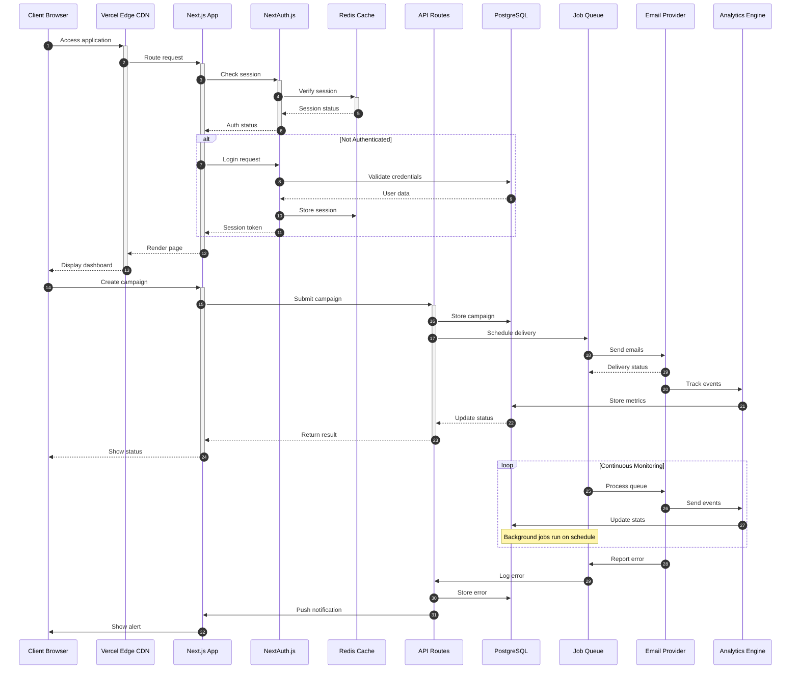

# PERFEXMAIL System Architecture Overview

## UC001: Manage Email Campaign Sequence Diagram

```mermaid
sequenceDiagram
    autonumber
    participant M as Marketer/Admin
    participant UI as Frontend UI
    participant API as Backend API
    participant DB as Database
    participant Queue as Job Queue
    participant ESP as Email Provider
    participant Cache as Redis Cache

    Note over M,ESP: Normal Flow - Campaign Creation and Management

    %% Campaign Creation & Setup
    M->>+UI: Navigate to campaign section
    UI->>+API: Request campaign dashboard
    API->>+DB: Fetch available templates & lists
    DB-->>-API: Return campaign resources
    API-->>-UI: Return dashboard data
    UI-->>-M: Display campaign dashboard

    M->>+UI: Initiate new campaign
    UI-->>-M: Show campaign creation form

    %% Campaign Configuration
    M->>+UI: Define campaign settings
    UI->>+API: Validate settings
    API-->>-UI: Settings validated
    UI-->>-M: Show content editor

    %% Content Management
    M->>+UI: Select/Create email content
    UI->>+API: Fetch template
    API->>+DB: Get template data
    DB-->>-API: Return template
    API-->>-UI: Return template data
    M->>UI: Customize content
    UI->>+API: Save campaign content
    API->>DB: Store content
    DB-->>API: Content saved
    API-->>-UI: Save confirmed
    UI-->>-M: Show targeting options

    %% Audience Selection
    M->>+UI: Select subscriber list/segment
    UI->>+API: Fetch subscriber counts
    API->>+DB: Calculate recipient count
    DB-->>-API: Return count
    API-->>-UI: Return audience size
    UI-->>-M: Display recipient summary

    %% Sending Configuration
    M->>+UI: Set sending options
    UI->>+API: Validate schedule
    API-->>-UI: Schedule confirmed
    UI-->>-M: Show review screen

    %% Campaign Launch
    M->>+UI: Review and submit campaign
    UI->>+API: Submit for sending
    API->>DB: Update campaign status
    API->>+Queue: Queue campaign
    Queue->>+ESP: Process campaign
    ESP-->>-Queue: Sending started
    Queue-->>-API: Update status
    API-->>-UI: Campaign launched
    UI-->>-M: Show success message

    %% Performance Monitoring
    M->>+UI: View campaign reports
    UI->>+API: Request analytics
    API->>+DB: Fetch campaign metrics
    DB-->>-API: Return metrics
    API-->>-UI: Return analytics data
    UI-->>-M: Display campaign performance

    Note over M,ESP: Alternative Flows

    %% A1: Save Draft
    rect rgb(240, 240, 240)
        M->>+UI: Save as draft
        UI->>+API: Store draft
        API->>DB: Save draft state
        DB-->>API: Draft saved
        API-->>-UI: Confirm save
        UI-->>-M: Show draft saved
    end

    %% A2: Test Email
    rect rgb(240, 240, 240)
        M->>+UI: Request test email
        UI->>+API: Process test
        API->>+ESP: Send test email
        ESP-->>-API: Test delivered
        API-->>-UI: Test complete
        UI-->>-M: Show test sent
    end

    %% A3: A/B Testing
    rect rgb(240, 240, 240)
        M->>+UI: Configure A/B test
        UI->>+API: Setup variants
        API->>DB: Store variants
        DB-->>API: Test saved
        API-->>-UI: Test ready
        UI-->>-M: Show A/B setup
    end

    %% A4: Error Handling
    rect rgb(240, 240, 240)
        ESP->>+Queue: Report failure
        Queue->>+API: Log error
        API->>DB: Store error
        API->>+UI: Push notification
        UI-->>-M: Display error
    end

    %% A5: Edit Scheduled
    rect rgb(240, 240, 240)
        M->>+UI: Modify scheduled
        UI->>+API: Update schedule
        API->>DB: Update campaign
        API->>Queue: Modify queue
        Queue-->>API: Queue updated
        API-->>-UI: Update complete
        UI-->>-M: Show changes
    end
```

## UC001: Manage Email Campaign Activity Diagram

```mermaid
flowchart TD
    %% Start and End nodes
    Start((Start)) --> AccessCampaign
    Success((Success))
    Error((Error))

    %% Main Activities
    AccessCampaign[Access Campaign Section] --> CheckAuth{Authenticated?}
    
    CheckAuth -- No --> Login[Login Required]
    Login --> CheckAuth
    
    CheckAuth -- Yes --> Dashboard[View Campaign Dashboard]
    Dashboard --> CreateCampaign[Create New Campaign]
    
    %% Campaign Setup Process
    CreateCampaign --> DefineSettings[Define Campaign Settings]
    DefineSettings --> ValidateSettings{Settings Valid?}
    
    ValidateSettings -- No --> FixSettings[Fix Settings]
    FixSettings --> DefineSettings
    
    ValidateSettings -- Yes --> SelectContent[Select/Create Content]
    
    %% Content Management
    SelectContent --> ContentChoice{Content Source?}
    ContentChoice -- New --> CreateTemplate[Create New Template]
    ContentChoice -- Existing --> SelectTemplate[Select Existing Template]
    
    CreateTemplate --> CustomizeContent[Customize Content]
    SelectTemplate --> CustomizeContent
    
    CustomizeContent --> ValidateContent{Content Valid?}
    ValidateContent -- No --> EditContent[Edit Content]
    EditContent --> CustomizeContent
    
    %% Audience Selection
    ValidateContent -- Yes --> SelectAudience[Select Target Audience]
    SelectAudience --> AudienceChoice{Audience Type?}
    AudienceChoice -- List --> SelectList[Choose Subscriber List]
    AudienceChoice -- Segment --> SelectSegment[Choose Segment]
    
    SelectList --> ValidateAudience{Audience Valid?}
    SelectSegment --> ValidateAudience
    
    ValidateAudience -- No --> ReviseAudience[Revise Selection]
    ReviseAudience --> SelectAudience
    
    %% Sending Configuration
    ValidateAudience -- Yes --> ConfigureSending[Configure Sending Options]
    ConfigureSending --> SendingChoice{Sending Type?}
    
    SendingChoice -- Schedule --> SetSchedule[Set Schedule]
    SendingChoice -- Immediate --> PrepareToSend[Prepare for Sending]
    
    SetSchedule --> ReviewCampaign[Review Campaign]
    PrepareToSend --> ReviewCampaign
    
    %% Final Review and Launch
    ReviewCampaign --> FinalCheck{Ready to Send?}
    
    FinalCheck -- No --> SaveDraft[Save as Draft]
    SaveDraft --> Success
    
    FinalCheck -- Test --> SendTest[Send Test Email]
    SendTest --> ReviewCampaign
    
    FinalCheck -- Yes --> ValidateAll{All Validations Pass?}
    
    ValidateAll -- No --> ReviewErrors[Review Errors]
    ReviewErrors --> ReviewCampaign
    
    ValidateAll -- Yes --> QueueCampaign[Queue Campaign]
    
    %% Campaign Processing
    QueueCampaign --> ProcessCampaign{Processing}
    
    ProcessCampaign -- Success --> UpdateStatus[Update Campaign Status]
    UpdateStatus --> NotifySuccess[Notify Success]
    NotifySuccess --> Success
    
    ProcessCampaign -- Failure --> LogError[Log Error]
    LogError --> NotifyError[Notify Error]
    NotifyError --> Error

    %% Styling
    style Start fill:#2ecc71,stroke:#27ae60,stroke-width:2px,color:white
    style Success fill:#2ecc71,stroke:#27ae60,stroke-width:2px,color:white
    style Error fill:#e74c3c,stroke:#c0392b,stroke-width:2px,color:white
    
    %% Style all process nodes
    style AccessCampaign fill:#3498db,stroke:#2980b9,stroke-width:2px,color:white
    style CreateCampaign fill:#3498db,stroke:#2980b9,stroke-width:2px,color:white
    style DefineSettings fill:#3498db,stroke:#2980b9,stroke-width:2px,color:white
    style SelectContent fill:#3498db,stroke:#2980b9,stroke-width:2px,color:white
    style CustomizeContent fill:#3498db,stroke:#2980b9,stroke-width:2px,color:white
    style SelectAudience fill:#3498db,stroke:#2980b9,stroke-width:2px,color:white
    style ConfigureSending fill:#3498db,stroke:#2980b9,stroke-width:2px,color:white
    style ReviewCampaign fill:#3498db,stroke:#2980b9,stroke-width:2px,color:white
    style QueueCampaign fill:#3498db,stroke:#2980b9,stroke-width:2px,color:white
    
    %% Style all decision nodes
    style CheckAuth fill:#f1c40f,stroke:#f39c12,stroke-width:2px,color:black
    style ValidateSettings fill:#f1c40f,stroke:#f39c12,stroke-width:2px,color:black
    style ContentChoice fill:#f1c40f,stroke:#f39c12,stroke-width:2px,color:black
    style AudienceChoice fill:#f1c40f,stroke:#f39c12,stroke-width:2px,color:black
    style SendingChoice fill:#f1c40f,stroke:#f39c12,stroke-width:2px,color:black
    style FinalCheck fill:#f1c40f,stroke:#f39c12,stroke-width:2px,color:black
    style ValidateAll fill:#f1c40f,stroke:#f39c12,stroke-width:2px,color:black
    style ProcessCampaign fill:#f1c40f,stroke:#f39c12,stroke-width:2px,color:black
    
    %% Style error handling nodes
    style LogError fill:#e74c3c,stroke:#c0392b,stroke-width:2px,color:white
    style NotifyError fill:#e74c3c,stroke:#c0392b,stroke-width:2px,color:white
```

## High-Level System Component Interaction

```mermaid
sequenceDiagram
    autonumber
    participant User as Client Browser
    participant CDN as Vercel Edge CDN
    participant App as Next.js App
    participant Auth as NextAuth.js
    participant Redis as Redis Cache
    participant API as API Routes
    participant DB as PostgreSQL
    participant Queue as Job Queue
    participant ESP as Email Provider
    participant Analytics as Analytics Engine

    %% Authentication Flow
    User->>+CDN: Access application
    CDN->>+App: Route request
    App->>+Auth: Check session
    Auth->>+Redis: Verify session
    Redis-->>-Auth: Session status
    Auth-->>-App: Auth status
    alt Not Authenticated
        App->>Auth: Login request
        Auth->>DB: Validate credentials
        DB-->>Auth: User data
        Auth->>Redis: Store session
        Auth-->>App: Session token
    end
    App-->>-CDN: Render page
    CDN-->>-User: Display dashboard

    %% Campaign Operation Flow
    User->>+App: Create campaign
    App->>+API: Submit campaign
    API->>DB: Store campaign
    API->>Queue: Schedule delivery
    Queue->>ESP: Send emails
    ESP-->>Queue: Delivery status
    ESP->>Analytics: Track events
    Analytics->>DB: Store metrics
    DB-->>API: Update status
    API-->>-App: Return result
    App-->>-User: Show status

    %% Background Processing
    loop Continuous Monitoring
        Queue->>ESP: Process queue
        ESP->>Analytics: Send events
        Analytics->>DB: Update stats
        Note over Queue,DB: Background jobs run on schedule
    end

    %% Error Handling
    ESP->>Queue: Report error
    Queue->>API: Log error
    API->>DB: Store error
    API->>App: Push notification
    App->>User: Show alert
```

