# PERFEXMAIL Use Case Diagram

## System Use Case Overview

```mermaid
graph TB
    %% Actors
    Marketer[👤 Marketer<br/>Team Member]
    Designer[👤 Designer<br/>Team Member] 
    Admin[👤 Administrator]
    TeamLead[👤 Team Lead]
    ESP[🌐 Email Service<br/>Provider]
    System[⚙️ System<br/>Automated]

    %% Core Email Marketing Use Cases
    UC001[UC001: Manage Email<br/>Campaigns]
    UC002[UC002: Manage Subscriber<br/>Lists]
    UC003[UC003: Manage Email<br/>Templates]
    UC004[UC004: Automate Email<br/>Workflows]
    UC008[UC008: View Reports<br/>& Analytics]
    UC009[UC009: Manage Forms]

    %% Administrative Use Cases
    UC005[UC005: Manage Users &<br/>Team Accounts]
    UC006[UC006: System Administration<br/>& Configuration]
    UC007[UC007: Manage Usage Plans<br/>& Limits]
    UC010[UC010: Manage Sending<br/>Infrastructure]
    UC011[UC011: Manage Blacklists]

    %% Extended Use Cases
    UC012[UC012: Import/Export<br/>Subscribers]
    UC013[UC013: Send Test<br/>Emails]
    UC014[UC014: Schedule<br/>Campaigns]
    UC015[UC015: Track Email<br/>Engagement]
    UC016[UC016: Manage Custom<br/>Fields]
    UC017[UC017: Create Email<br/>Segments]
    UC018[UC018: Configure Domain<br/>Authentication]
    UC019[UC019: Process Bounce<br/>Handling]
    UC020[UC020: Monitor System<br/>Health]

    %% Marketer Relationships
    Marketer --> UC001
    Marketer --> UC002
    Marketer --> UC003
    Marketer --> UC004
    Marketer --> UC008
    Marketer --> UC009
    Marketer --> UC012
    Marketer --> UC013
    Marketer --> UC014
    Marketer --> UC015
    Marketer --> UC016
    Marketer --> UC017

    %% Designer Relationships
    Designer --> UC003
    Designer --> UC009
    Designer --> UC001

    %% Team Lead Relationships (inherits from Marketer)
    TeamLead --> UC001
    TeamLead --> UC002
    TeamLead --> UC003
    TeamLead --> UC004
    TeamLead --> UC008
    TeamLead --> UC007
    TeamLead --> UC005

    %% Administrator Relationships
    Admin --> UC005
    Admin --> UC006
    Admin --> UC007
    Admin --> UC010
    Admin --> UC011
    Admin --> UC018
    Admin --> UC020
    Admin --> UC001
    Admin --> UC002
    Admin --> UC003
    Admin --> UC004
    Admin --> UC008
    Admin --> UC009

    %% System/Automated Relationships
    System --> UC015
    System --> UC019
    System --> UC020
    System --> UC004

    %% ESP Relationships
    ESP --> UC015
    ESP --> UC019
    ESP --> UC013

    %% Include Relationships
    UC001 -.->|includes| UC013
    UC001 -.->|includes| UC014
    UC001 -.->|includes| UC015
    UC002 -.->|includes| UC012
    UC002 -.->|includes| UC016
    UC002 -.->|includes| UC017
    UC008 -.->|includes| UC015
    UC010 -.->|includes| UC018
    UC010 -.->|includes| UC019

    %% Actor Inheritance
    TeamLead -.->|inherits| Marketer
    
    %% System Boundary
    subgraph PERFEXMAIL_System["🎯 PERFEXMAIL Email Marketing Platform"]
        UC001
        UC002
        UC003
        UC004
        UC005
        UC006
        UC007
        UC008
        UC009
        UC010
        UC011
        UC012
        UC013
        UC014
        UC015
        UC016
        UC017
        UC018
        UC019
        UC020
    end

    %% Styling
    classDef actor fill:#e1f5fe,stroke:#01579b,stroke-width:2px,color:#000
    classDef usecase fill:#f3e5f5,stroke:#4a148c,stroke-width:2px,color:#000
    classDef system fill:#fff3e0,stroke:#e65100,stroke-width:2px,color:#000
    classDef admin fill:#ffebee,stroke:#b71c1c,stroke-width:2px,color:#000

    class Marketer,Designer,TeamLead actor
    class Admin admin
    class ESP,System system
    class UC001,UC002,UC003,UC004,UC008,UC009,UC012,UC013,UC014,UC015,UC016,UC017 usecase
    class UC005,UC006,UC007,UC010,UC011,UC018,UC019,UC020 admin
```

## Actor Descriptions

### **Primary Actors (Human Users)**

| Actor | Description | Access Level |
|-------|-------------|--------------|
| **Marketer (Team Member)** | Core user who creates and manages email marketing campaigns, subscriber lists, and views performance analytics | Standard User |
| **Designer (Team Member)** | Specializes in creating and customizing email templates and visual content for campaigns | Standard User |
| **Team Lead** | Senior team member with additional permissions to manage team resources and view team-wide analytics | Elevated User |
| **Administrator** | System administrator with full access to platform configuration, user management, and infrastructure settings | Admin User |

### **Secondary Actors (External Systems)**

| Actor | Description | Interaction Type |
|-------|-------------|------------------|
| **Email Service Provider (ESP)** | External email delivery services (SendGrid, SMTP servers) that handle email sending and provide delivery feedback | System Integration |
| **System (Automated)** | Automated system processes that handle background tasks, monitoring, and scheduled operations | Internal Automation |

## Use Case Categories

### **📧 Core Email Marketing Use Cases**
- **UC001: Manage Email Campaigns** - Create, edit, schedule, and send email campaigns
- **UC002: Manage Subscriber Lists** - Organize and maintain subscriber databases
- **UC003: Manage Email Templates** - Design and manage reusable email templates
- **UC004: Automate Email Workflows** - Create and manage automated email sequences
- **UC008: View Reports & Analytics** - Access performance metrics and campaign analytics
- **UC009: Manage Forms** - Create and manage subscription and lead capture forms

### **👥 User & Team Management Use Cases**
- **UC005: Manage Users & Team Accounts** - User registration, authentication, and profile management
- **UC007: Manage Usage Plans & Limits** - Monitor and control resource usage and limits

### **⚙️ System Administration Use Cases**
- **UC006: System Administration & Configuration** - Configure system settings and preferences
- **UC010: Manage Sending Infrastructure** - Configure email sending servers and domain authentication
- **UC011: Manage Blacklists** - Maintain global email blacklists for compliance

### **🔧 Extended Functionality Use Cases**
- **UC012: Import/Export Subscribers** - Bulk subscriber data management
- **UC013: Send Test Emails** - Campaign testing and preview functionality
- **UC014: Schedule Campaigns** - Advanced campaign scheduling features
- **UC015: Track Email Engagement** - Monitor opens, clicks, and engagement metrics
- **UC016: Manage Custom Fields** - Configure custom subscriber data fields
- **UC017: Create Email Segments** - Advanced subscriber segmentation
- **UC018: Configure Domain Authentication** - Setup SPF, DKIM, and DMARC records
- **UC019: Process Bounce Handling** - Automated bounce and complaint processing
- **UC020: Monitor System Health** - System performance and health monitoring

## Relationship Types

### **Association Relationships**
- **Solid arrows (→)**: Direct interaction between actor and use case
- **Dotted arrows (-.->)**: Include relationships showing use case dependencies

### **Inheritance Relationships**
- **Team Lead inherits from Marketer**: Team Lead has all Marketer permissions plus additional elevated access

### **Include Relationships**
- **UC001 includes UC013, UC014, UC015**: Campaign management requires testing, scheduling, and tracking
- **UC002 includes UC012, UC016, UC017**: List management includes import/export, custom fields, and segmentation
- **UC008 includes UC015**: Analytics requires engagement tracking data
- **UC010 includes UC018, UC019**: Infrastructure management includes domain setup and bounce handling

## Security and Access Control

### **Permission Levels**
1. **Standard User** (Marketer, Designer): Core email marketing functionality
2. **Elevated User** (Team Lead): Team resource management and oversight
3. **Admin User** (Administrator): Full system configuration and user management
4. **System Integration**: Automated processes and external service interactions

### **Multi-Tenant Isolation**
- All use cases respect team-based data isolation
- Users can only access data within their assigned team(s)
- Administrators have cross-team visibility for system management

This use case diagram provides a comprehensive overview of the PERFEXMAIL system's functionality, showing how different types of users interact with various features while maintaining appropriate access controls and security boundaries. 